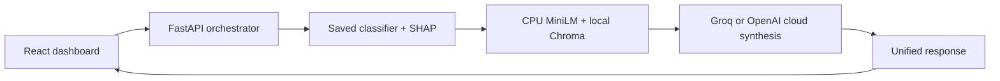

# AegisHealth / ClinAgent

CPU-first clinical decision-support research prototype with a FastAPI analysis
pipeline, a React clinical review dashboard, and reproducible evaluation. All five
implementation phases are present. **Live cloud synthesis and the complete
three-second latency target remain unverified until a provider key is configured.**

## Start the complete application

From the repository root, with Python 3.12/3.13, uv and Node.js 22.12+:

```bash
uv sync --locked --extra rag --extra api
npm --prefix frontend ci
npm --prefix frontend run build
# On a fresh checkout only, copy .env.example to .env and add your provider key.
uv run --extra rag --extra api uvicorn aegishealth.api.app:app --host 127.0.0.1 --port 8000 --no-access-log
```

Open [the dashboard](http://127.0.0.1:8000). This server serves the built frontend
and API from the same origin. The local workspace already contains model artifacts
and the guideline index. On a fresh checkout, run the training and ingestion
commands below before starting the API. Keep one backend worker on low-end devices
because each worker loads its own models.

Set `LLM_PROVIDER=groq` and `GROQ_API_KEY` in `.env`, or use
`LLM_PROVIDER=openai` with `OPENAI_API_KEY`. Restart the server after changing
configuration. Groq defaults to cloud-hosted `openai/gpt-oss-20b`; OpenAI defaults
to `gpt-4.1-mini`. `LLM_MODEL` overrides either default for an account-enabled
model. No generative model weights are downloaded locally. Never put API keys in
frontend variables. A missing key yields a clearly labeled partial result with
real model/SHAP/evidence output and no fabricated summary.

For frontend development, run `npm --prefix frontend run dev` alongside the API;
Vite proxies `/analyze` and `/health` to port 8000. The optional test suite runs
with `npm --prefix frontend run test:e2e` after `npx playwright install chromium`
inside `frontend/`; it expects the real backend on port 8000.

This is a loopback-bound research application, without production authentication,
patient-record storage, or a claim of clinical readiness. The UI starts empty;
“Load example” fills a synthetic case without submitting it. Patient measurements,
model outputs and evidence are sent to the configured cloud provider only when
analysis is requested and a key is available. No patient values are stored in
browser storage or echoed in validation errors.

## Analysis API

`POST /analyze` accepts an object containing the 13 fields listed below. All fields
must be supplied; `ca` and `thal` may explicitly be null. Numeric strings, booleans,
extra keys, invalid categories, nonfinite numbers and out-of-range values are
rejected with HTTP 422. `GET /health` reports readiness and configuration, not a
verified cloud connection. OpenAPI documentation is at `/docs`.

The orchestrator runs CPU prediction and SHAP, constructs a query from observed
values of the top three contributing features, retrieves two passages, and calls
the configured cloud provider. Startup warms SHAP and MiniLM. Local CPU work is
serialized and excess overlapping requests receive HTTP 429 instead of an
unbounded CPU queue. Cloud I/O is asynchronous with a configured timeout.

The response includes `prediction`, `retrieval_query`, `evidence`, `synthesis`,
`timings_ms`, `analysis_id`, and `status` (`complete` or `partial`). The provider is
asked for three sentences with evidence references; output validation rejects
malformed JSON, incomplete generations, extra sentences and invalid evidence IDs.
This checks structure and reference existence, not clinical correctness or
semantic entailment. Retrieved documents are treated as untrusted data. Provider
failures return no summary and an explicit machine-readable reason.



## Run Phase 1

Requires [uv](https://docs.astral.sh/uv/) and Python 3.12 or 3.13. From the repository root:

```bash
uv sync --locked
uv run python -m aegishealth.train
uv run python -m aegishealth.explain --patient examples/patient.json
uv run pytest -q
uv run ruff check aegishealth tests
```

Training downloads the original Cleveland file from the official UCI archive on
first use. Subsequent runs use the cached file. To use a previously downloaded
original file: `uv run python -m aegishealth.train --data /absolute/path/processed.cleveland.data`.
No GPU, local LLM, API key, or guideline document is required for Phase 1.
The `xgboost-cpu` distribution avoids CUDA runtime dependencies. Numerical work is
limited to two threads and cross-validation runs serially.

The comparison selects **regularized logistic regression (`C=0.1`)**, rather than
assuming XGBoost wins. Read [the data audit and comparison](reports/phase1.md) for
all candidates, validation details and limitations. Full machine-readable
statistics and per-fold metrics are in `reports/`. `uv.lock` pins the tested environment.

## Saved artifacts

Training creates the following local, git-ignored files under `artifacts/`:

| File | Purpose |
|---|---|
| `model.joblib` | Complete fitted preprocessing + selected classifier pipeline |
| `preprocessor.joblib` | Numeric imputation/scaling and categorical imputation/encoding |
| `scaler.joblib` | Requested StandardScaler, for numeric columns only |
| `background.joblib` | 32 development-only raw rows used as the SHAP reference |
| `split.npz` | Fixed development and holdout row indices for Phase 5 |
| `metadata.json` | Feature order, dataset checksum, selection and comparison details |

Use the complete pipeline for inference: applying the standalone scaler to all
13 columns is incorrect. Joblib files are executable serialization; load only
artifacts generated by this project in a trusted local directory. Keep all files
from the same training run together. Training overwrites artifacts and reports.

## Patient input and output

The example is a synthetic demonstration, not a real patient's record. Input is
a JSON array of 13 numeric values, in this exact original UCI order:

| Position | Feature | Units / coding |
|---|---|---|
| 1 | `age` | Years |
| 2 | `sex` | Original dataset coding: 0 female, 1 male |
| 3 | `cp` | 1 typical angina, 2 atypical angina, 3 non-anginal pain, 4 asymptomatic |
| 4 | `trestbps` | Resting blood pressure, mm Hg |
| 5 | `chol` | Serum cholesterol, mg/dL |
| 6 | `fbs` | Fasting blood sugar >120 mg/dL: 0 false, 1 true |
| 7 | `restecg` | 0 normal, 1 ST-T abnormality, 2 probable/definite LV hypertrophy |
| 8 | `thalach` | Maximum achieved heart rate, beats/min |
| 9 | `exang` | Exercise-induced angina: 0 no, 1 yes |
| 10 | `oldpeak` | Exercise-induced ST depression relative to rest |
| 11 | `slope` | 1 upsloping, 2 flat, 3 downsloping |
| 12 | `ca` | Number of major vessels colored by fluoroscopy, 0–3 |
| 13 | `thal` | 3 normal, 6 fixed defect, 7 reversible defect |

Use JSON `null` for unknown values. Inference applies the saved training
imputation and explicitly marks missing inputs in the result. All-missing input,
invalid category codes, nonfinite numbers and values outside broad sanity bounds
are rejected. These bounds are input checks, not diagnostic thresholds.

Output includes disease probability, the fixed 0.5 classification threshold,
SHAP reference probability, all 13 signed contributions, three strongest absolute
contributors, and up to three positive contributors under `top_risk_factors`.
Negative contributions are never mislabeled as increasing risk. Fewer than three
positive contributors are returned when appropriate.

Permutation SHAP operates on whole original features through the saved pipeline,
so explanations remain compatible with every candidate model and preserve valid
category codes. It uses 32 background rows and ten forward/reverse permutation
cycles. Contributions sum with the reference probability to the prediction; the
code checks this identity. Values are approximate probability contributions,
not log odds or causal effects. Correlated features and artificial combinations
of otherwise valid patient attributes can affect interpretation. Reuse
`PatientExplainer` in a long-lived process to avoid repeated model loading and
SHAP/Numba startup costs; the future API should warm it at startup.

## Run Phase 2

Install the optional retrieval dependencies and index the downloaded Executive Summary:

```bash
uv sync --locked --extra rag
uv run --extra rag python -m aegishealth.rag ingest --source data/knowledge_base/acc_aha_2019_executive_summary.txt
uv run --extra rag python -m aegishealth.rag query "high cholesterol and age over 50" --offline
uv run --extra rag pytest -q
```

For a different PDF or TXT, pass its path with `--source`. Both commands accept
`--index /absolute/path/to/chroma`; the default is `artifacts/chroma/`. The first
embedding load downloads the pinned `sentence-transformers/all-MiniLM-L6-v2`
revision into `artifacts/embedding_cache/`. Subsequent operations can use
`--offline`. No API key or local generative LLM is needed. On Linux/Windows,
the lockfile selects CPU-only PyTorch. Encoder and Chroma HNSW work use two threads;
embedding batches contain 16 chunks.

LangChain splits the text into at most 500 characters with a target overlap of
50 characters, preserving paragraph/word boundaries where possible. Actual overlap
can be smaller at separators and page boundaries. Standalone headings, publication/staff material, and the bibliography are excluded
from retrieval; the PDF-derived text also excludes preamble/methodology sections
when their boundary markers are present. The current index contains 140 chunks; the saved source stays complete.
PDF inputs preserve one-based PDF page numbers and page labels. TXT inputs use
character offsets without inventing pagination.

The query returns exactly two stored snippets with source DOI, source checksum,
chunk ID, character offset, and cosine distance (lower is closer). Distances are
not confidence scores. The loader checks basic document identity and text content;
it does not certify completeness or extraction accuracy. Review the cited source
when tables, conditions, or dosage details matter.

Re-ingesting the same file and configuration does not duplicate chunks. A changed
source creates a new collection; only a completed build becomes active. Older
collections remain available to existing readers and occupy disk space. To
reclaim them, rebuild in a fresh `--index` directory and remove the old directory
only after stopping its readers. Do not delete `ingest.lock` while a writer is
running. After an interrupted writer, confirm it has stopped before removing a
stale lock and retrying.

The [Phase 2 verification report](reports/phase2.md) records persistence, exact
source matching, timing, and known retrieval misses. A smoke query about aspirin
for adults over 70 did not retrieve the specific age warning within the top two;
this baseline must not be treated as a complete medication safety check. Formal
labeled Precision@k evaluation remains in Phase 5. The future synthesis layer
must preserve the conditions in retrieved text and must not infer patient facts
such as diabetes or LDL cholesterol from absent inputs.

## Phase 5 evaluation

```bash
uv run --extra rag --extra api python -m aegishealth.evaluate --api-url http://127.0.0.1:8000 --requests 10
uv run --extra rag --extra api pytest -q
uv run --extra rag --extra api ruff check aegishealth tests
```

The evaluator verifies the dataset checksum and disjoint saved split, scores the
61 untouched holdout records, evaluates six source-grounded retrieval judgments,
and times actual `/analyze` HTTP calls. Only complete responses with cloud synthesis
count toward the three-second target. The target passes only when every requested
call succeeds in under three seconds. Partial responses never count as success.

Holdout: accuracy **0.8852**, precision **0.8387**, recall **0.9286**, F1 **0.8814**,
ROC-AUC **0.9610**. Diagnostic retrieval Precision@2: **0.5833**. These small-sample
results do not establish clinical performance. The relevance judgments are
implementation-time seed labels, not independent clinician annotations. The known
aspirin-age miss remains. [Final validation](reports/final_validation.md) explains
methods, limitations, and why live cloud latency is currently unverified;
[raw metrics](reports/evaluation.json) preserve each measurement.

The [2019 ACC/AHA Executive Summary](https://www.ahajournals.org/doi/10.1161/CIR.0000000000000677)
is saved as a PDF-derived TXT in `data/knowledge_base/`. Your DOI ending in `0678`
is the full guideline, while `0677` is its companion Executive Summary.
See [document preparation](data/knowledge_base/README.md). The earlier Phase 1/2
reports are historical snapshots; the integrated index now excludes additional
nonclinical sections.

## Implementation references

Current guidance was checked against [FastAPI lifespan](https://fastapi.tiangolo.com/advanced/events/),
[Tailwind with Vite](https://tailwindcss.com/docs/installation/using-vite),
[Groq's compatible API](https://console.groq.com/docs/openai),
[Groq GPT-OSS 20B](https://console.groq.com/docs/model/openai/gpt-oss-20b), and
[OpenAI chat completions](https://developers.openai.com/api/reference/resources/chat/subresources/completions/methods/create).
The UI design plan is in [frontend/DESIGN.md](frontend/DESIGN.md).

## Scope and attribution

The model predicts **existing disease presence in the Cleveland cohort**, not
future or ten-year ASCVD risk. This small historical diagnostic cohort and its
testing-dependent features do not establish suitability for primary-prevention
screening. The best cross-validation result remains provisional until holdout
and external validation. No claim of clinical readiness or three-second
end-to-end performance is made at this stage.

Dataset: Janosi, A., Steinbrunn, W., Pfisterer, M., & Detrano, R. (1989).
[Heart Disease, UCI Machine Learning Repository](https://doi.org/10.24432/C52P4X),
CC BY 4.0. The original `num` values 1–4 are mapped to disease present, and 0 to absent.

## Research manuscript

The implementation-grounded [IEEE LaTeX manuscript](paper/main.tex),
[compiled PDF](paper/main.pdf), [published references](paper/references.bib),
and [Mermaid architecture source](paper/figures/orchestration.mmd) are in
[`paper/`](paper/README.md). The paper distinguishes measured classifier and
retrieval results from unmeasured clinical and cloud-generation outcomes.
